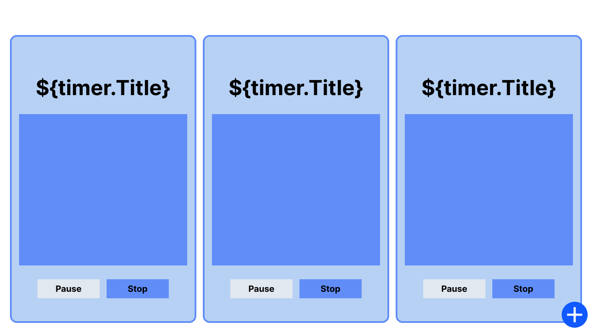

# Play Timer - the timer for Games & Tournaments

## Table of contents

- [Overview](#overview)
  - [Challenge](#challenge)
  - [Concept](#concept)
  - [How It Would Work](#mechanics)
  - [Component Hierarchy](#hierarchy)
- [My process](#my-process)
  - [Built with](#built-with)
  - [What I learned](#what-i-learned)
- [Author](#author)

## Overview

### Challenge

This idea originated from a recent issue encountered during a visit to a local tournament center this week. The center has monitors positioned at a high angles on the walls, with the intention of displaying tournament information, in this case, a timer(s). However, they face a challenge as they host multiple tournaments simultaneously. Consequently, they require a user-friendly website or app capable of streaming multiple timers, each with its own unqiue identifier. The priority is for this application to be lightweight and easy to use.

### Concept

I started sketching up a solution that accounted for mobile first (I imagined that judges or tournament holders would walk around with phones with the timers on them to give that information to players as needed), but speaking with the stakeholder, for this particular stakeholder, a layout that accounts for 3 tournaments and uses the space of the monitor more efficiently is what will make it to production. But the concept helped me think through how to execute in code, and whether a maximum of three tournament timers or ten, the conecpt remains the same.

#### Mechanics

How I imagine this working currently is:

1. When a user goes to the website, a useEffect would fire off and set just a single one of these empty timer components set to the "intialize" stage to state.
2. When a user would click on "add timer" the timer content changes to the first part of the form, and then when they click next, the next stage of the timer component is triggered prompting a new part of the form to show up.
3. Once all of the information has been collected, and the user clicks "Create" the timer initializes a function that's coded inside of it, setting an actual digital timer to state, along with a progress bar or circle, and update the state on the main component of the app, added a new empty timer component to the screen.
4. When a timer elapses, an alert shows up on the screen notifying the user that that particular timer is over, and a few choices would show up on the timer, to either close or delete the timer, or restart the timer. I imagine some of these tournaments will have multiple rounds after all.

### Hierarchy

Below is the Component Hierarchy Diagram. My goal in development is program a timer component that has a number of prompts, stages, and functions (to control, edit, and cancel the timers) built into it. With this, two main components should exist, or top level components exist:

- An alert, that would have the name of the timer object passed to it, that shows up on screen when that timers duration has elapsed.
- And then the actual timer itself. This will have various Chakra UI components in it that will be used to form the various prompts that will show up when a user clicks on "New Timer".

### Links

- Live Site URL:

## My process

I've had some time to think through and update the process. But the major changes so far, is that the timers will be side by side in the grid rather than 3 long strips, and they won't automatically render another empty timer, rather a button on the page will allow users to "add a timer" which renders a modal with inputs for users. I've had time to come up with a lo-fi mockup that has helped me to think through the logic a little bit better.

### Built with

- ReactJS
- Typescript
- Chakra UI
- Bun

### What I learned

## Author

- Website - [anthonyjmedina.com](https://www.your-site.com)
- Frontend Mentor - [@ajm24027](https://www.frontendmentor.io/profile/ajm24027)
- GitHub - [@ajm24027](https://github.com/ajm24027)
